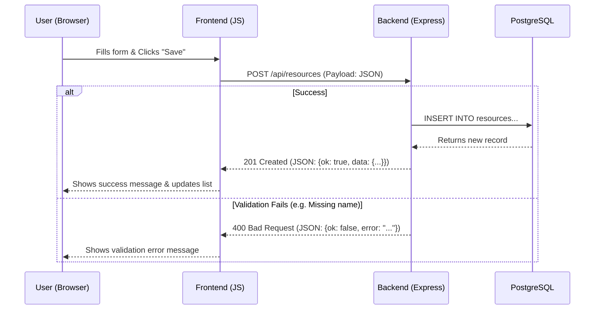
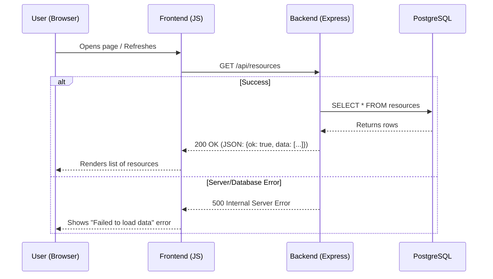
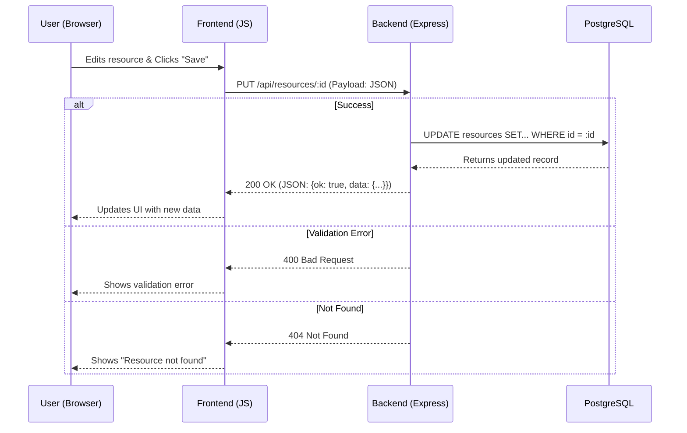
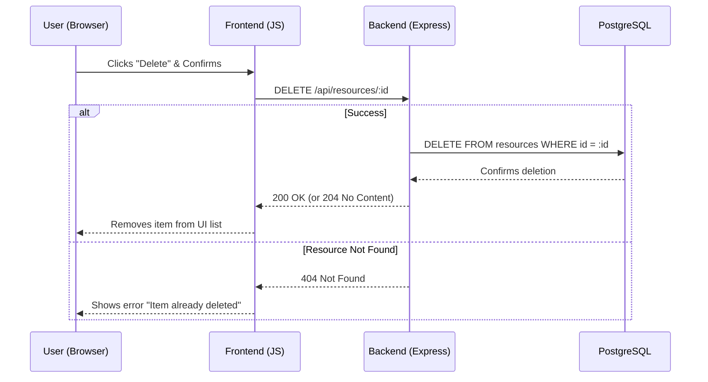

# Booking System: CRUD Operations Data Flow

This document models the data flow for Create, Read, Update, and Delete operations in Phase 6 of the Booking System.

## 1. CREATE (C)

## 2. READ (R)

## 3. UPDATE (U)

## 4. DELETE (D)

